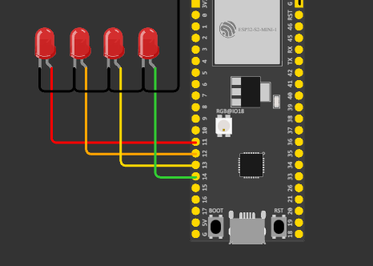

# Esp-32 - Teste de Structs

### Objetivos:
---
- Os leds devem acender sequencialmente, percorrendo a struct `pins leds`.
- O delay entre cada led é de 200ms.
- O delay entre cada loop é de 1s.

### Como testar:
---
- Utilizando ArduinoIDE:
  Importe o arquivo ou código de "main.c" no projeto Arduino.

- Simulador Wokwi:
  Você pode verificar e testar o projeto [**clicando aqui**](https://wokwi.com/projects/410512422111710209)

 

